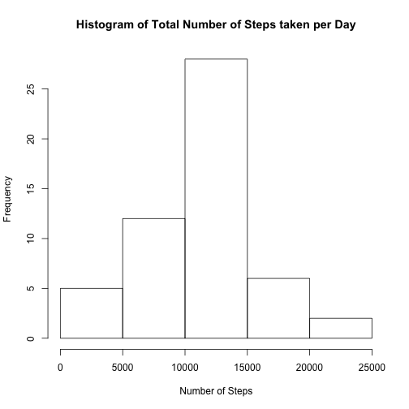
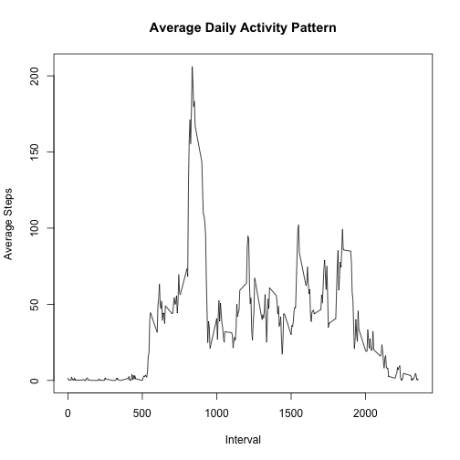
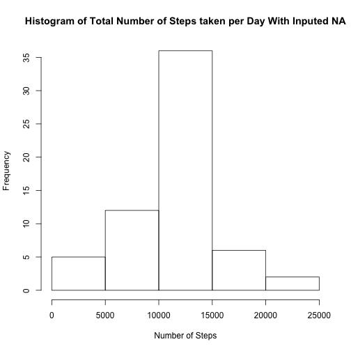
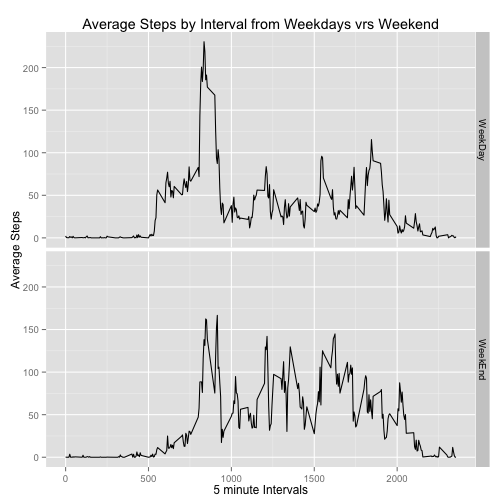

## Loading and preprocessing the data
First Check if a cvs data file is in data folder, if not it should
be created and unzipped.

Load the csv file data into a dataframe.


```r
files <- dir(path = "./data",pattern = '.csv');
if(length(files)==0){
        dir.create("./data");
        unzip(zipfile = "./activity.zip",exdir = "./data");
}
activity_dataset = read.csv("./data/activity.csv");
```


## What is mean total number of steps taken per day?
Now we get a glimps of the data and make some basic desciption of the 
data per date with a histogram and getting mean and median.

```r
activity_total_step <- aggregate(steps ~ date, data=activity_dataset, FUN=sum);

hist(activity_total_step$steps, 
     main = "Histogram of Total Number of Steps taken per Day", 
     xlab = "Number of Steps");
```

 

The Mean of total steps is

```r
mean(activity_total_step$steps);
```

```
## [1] 10766.19
```

The Median of total steps is

```r
median(activity_total_step$steps);
```

```
## [1] 10765
```
   
   
## What is the average daily activity pattern?

```r
activity_total_interval = aggregate(steps~interval,
                                    data=activity_dataset,
                                    FUN=mean);
plot(x=activity_total_interval$interval,
     y=activity_total_interval$steps, 
     type='l',
     main="Average Daily Activity Pattern",
     xlab="Interval",
     ylab="Average Steps");
```

 

```r
activity_max <- activity_total_interval[which.max(activity_total_interval$steps), ];
activity_max;
```

```
##     interval    steps
## 104      835 206.1698
```

The Interval with the maximun steps average is **835** 
with an average of **206.17** steps


## Imputing missing values

To get the missing values in the data (steps = NA) we must get a subset 
containing only NA values


```r
activity_missing <- activity_dataset[is.na(activity_dataset$steps),];
nrow(activity_missing);
```

```
## [1] 2304
```

To fill NA values we use the average steps of the interval from all dates.
We iterate through the Interval Aggregate Dataset and asign its average step 
value to all NA Values with the same interval in the new dataset copied from 
the original activity dataset.

```r
activity_filled_dataset <- activity_dataset;
for(i in c(0:nrow(activity_total_interval))){
        activity_filled_dataset[ 
                is.na(activity_filled_dataset$steps) & 
                activity_filled_dataset$interval 
                        == activity_total_interval[i,"interval"]
                ,"steps"] <- activity_total_interval[i,"steps"];
}
nrow(activity_filled_dataset[is.na(activity_filled_dataset$steps),]);
```

```
## [1] 0
```

Now we get a glimps of the new dataset with inputed values for missing values.

```r
activity_filled_total <- aggregate(steps ~ date, data=activity_filled_dataset, FUN=sum)
hist(activity_filled_total$steps, 
     main = "Histogram of Total Number of Steps taken per Day With Inputed NA", 
     xlab = "Number of Steps");
```

 


The Mean of total steps is

```r
mean(activity_filled_total$steps);
```

```
## [1] 10766.19
```

The Median of total steps is

```r
median(activity_filled_total$steps);
```

```
## [1] 10766.19
```

The mean values doesn't change with the inputed na values but the median value
does change, it gets the same value as the mean. In the histogram the frecuency 
of total day steps gets greater in the class of 10,000 to 15,000 steps.


## Are there differences in activity patterns between weekdays and weekends?

First we create a utility frame to handle weekdays. Then we merge it by
using as.date function to date variable of the filled dataset and the weekdays()
function. We need ggplot library for this plotting weekdays and weekends
with a facet.


```r
weekday_dataset <- data.frame(
        "weekday"=c("Mon","Tue","Wed","Thu","Fri","Sat","Sun"),
        "weekclass"=c("WeekDay","WeekDay","WeekDay","WeekDay",
                      "WeekDay","WeekEnd","WeekEnd"));
activity_filled_dataset$weekday <- weekdays(as.Date(activity_filled_dataset$date),
                                            abbreviate=TRUE);
activity_filled_dataset<- merge(activity_filled_dataset,weekday_dataset,by="weekday");
activity_filled_summary<- aggregate(steps ~ interval+weekclass,data=activity_filled_dataset, FUN=mean);

ggplot(activity_filled_summary, aes(interval,steps)) + 
  geom_line() + 
  facet_grid(weekclass ~ .) + 
  labs(title="Average Steps by Interval from Weekdays vrs Weekend", 
       y="Average Steps", 
       x="5 minute Intervals")
```

 
